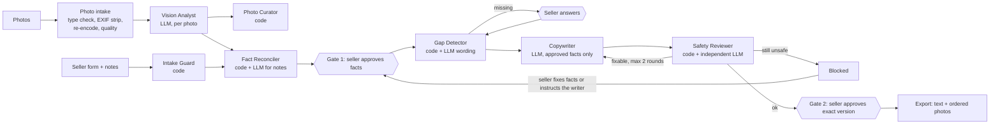

# AI Marketplace Listing Assistant

A local, multi-agent assistant that helps a seller prepare a **second-hand car listing**.
It analyses the seller's photos, proposes facts, asks for missing information, and writes
a Turkish title and description **only from facts the seller has approved**, then runs a
safety review and requires two human approvals before anything can be exported.

The core rule is **no evidence, no claim**: every sentence in a generated listing is
linked to an approved fact that came from the seller, from a photo the seller confirmed,
or from code. A sentence without such a source cannot be stored.

- **All data is synthetic.** No real customer or personal data is used. Market figures
  come from a generated dataset; they are not real prices and never a price recommendation.
- No marketplace integration: the output is copyable text plus the photos in order.
  Nothing is posted anywhere automatically.
- Design document (Turkish): [docs/architecture.md](docs/architecture.md).

## How it works



The **orchestrator is plain Python** (`workflow.py`), not an LLM: code decides what runs
next, and models only work inside individual agents. Listing status moves through an
explicit state machine that the database enforces as well. A blocked draft is not a
dead end: the seller goes back to the facts or gives the writer an instruction, and both
human gates apply again.

The listing is written in the owner's first-person voice and exported in the layout of
common Turkish car listings: title, a spec list ("Araç Bilgileri"), headed description
sections and an equipment list. The spec and equipment lists are rendered by code from
approved facts, so a longer listing still contains no unsourced sentence. The interface
is Turkish.

| Agent | Kind | Input | Output | Cannot |
| --- | --- | --- | --- | --- |
| Intake Guard | code | seller text | accepted values or refusal | call a model |
| Vision Analyst | LLM | one photo + observable field list | proposals with evidence photo | report unobservable fields, approve, write text |
| Photo Curator | code | vision views + quality metrics | order, cover, privacy flags | — |
| Fact Reconciler | code + LLM | seller facts, photo proposals, notes | *proposed* facts, conflicts | approve anything |
| Gap Detector | code + LLM | schema + approved facts | questions for the seller | see seller text |
| Market Analyst | code | approved make/model/year | synthetic price range | call a model, write text |
| Copywriter | LLM | approved facts only | title + sentences citing fact IDs | see photos or notes, cite unapproved facts |
| Safety Reviewer | code + LLM | draft + approved facts | issues; decision derived by code | clear an issue found by code |

## Security model (short)

- **Untrusted content is data.** Seller notes, text inside photos and change requests
  are tag-wrapped and HTML-escaped in prompts; injection wording is flagged and logged.
- **Validated contracts.** Every model answer must fit a strict Pydantic model; extra
  fields (for example `"approved": true`) cause the answer to be discarded.
- **Least privilege.** A permission matrix (data, tested cell by cell) decides which
  agent may call which tool. Tools are bound to one listing and take no listing ID.
- **Traceability.** `save_draft` refuses any sentence citing a non-approved fact; the
  reviewer blocks numbers that are not in the cited facts and absolute claims
  ("hatasız", "tramersiz", …) the seller did not state.
- **Human gates enforced by the database.** Triggers refuse leaving fact review without
  a gate-1 record, and refuse `approved`/`exported` unless the **latest** draft version
  has a final approval.
- **Personal data.** National ID numbers and IBANs (checksum-validated) are refused;
  phone/e-mail need explicit confirmation. Photo metadata (GPS) is removed on upload.
- **Append-only audit.** Audit log, agent runs, tool calls, approvals and safety reviews
  cannot be updated or deleted; logs contain masked values or hashes only.
- **Cost limits.** Upload size/count limits and a per-listing LLM call budget.

## Quick start (Windows PowerShell)

Requirements: Python 3.12+ and Git.

```powershell
git clone <your-fork-url> AI-Marketplace-Listing-Assistant
cd AI-Marketplace-Listing-Assistant
py -3 -m venv .venv
.venv\Scripts\Activate.ps1
python -m pip install -e ".[ui,dev]"

# Claude API credentials (only needed for analysis/writing; never commit them)
$env:ANTHROPIC_API_KEY = "<your key>"

streamlit run app/streamlit_app.py
```

The app listens on `http://localhost:8501` only (see `.streamlit/config.toml`), because
this MVP has no user accounts. Data is stored in `data/` (SQLite + photos, git-ignored).
On macOS/Linux use `python3 -m venv .venv` and `source .venv/bin/activate`.

## Tests and checks

```powershell
pytest                 # ~420 tests, no network, no API key needed
ruff check .
ruff format --check .
```

Tests use a deterministic fake model. `tests/test_red_team.py` runs the attack scenarios
of the design document against a deliberately compromised model;
`tests/test_golden_set.py` checks 20 synthetic listings. An optional live contract test
calls the real API: `$env:RUN_LIVE_TESTS = "1"; pytest tests/test_live_api.py`.

## Configuration

| Variable | Default | Meaning |
| --- | --- | --- |
| `ANTHROPIC_API_KEY` | — | Claude API key (read by the SDK, never stored by the app) |
| `LA_MODEL` | `claude-opus-5` | model ID |
| `LA_DATA_DIR` | `data` | SQLite database and photo folder |
| `LA_MAX_PHOTOS_PER_LISTING` | `20` | upload count limit |
| `LA_MAX_PHOTO_BYTES` | `10485760` | per-file size limit |
| `LA_MAX_LLM_CALLS_PER_LISTING` | `40` | model call budget per listing |

## Project layout

```
src/listing_assistant/
  workflow.py          orchestrator + service layer (security boundary)
  state_machine.py     the only code that changes a listing's status
  tools.py, toolset.py permission matrix, gate, listing-bound tools
  agents/              one module per agent
  llm.py, agent_io.py  model boundary and the shapes models may return
  models.py            internal data models (Pydantic)
  db/                  SQLite migrations (001-009) and repositories
  listing_format.py    final listing layout (title, specs, sections, equipment)
  images.py, photo_intake.py, pii.py, injection.py, claims.py, policy.py
  prompts/             versioned prompts; schemas/car.json field definitions
app/streamlit_app.py   thin UI
tests/                 unit, workflow, UI, red-team and golden-set tests
docs/architecture.md   design document
```

## Scope and known limitations

- Car category only (the house category is a data file away, planned for v0.2).
- Single local user, no authentication; there is no moderator panel (the seller recovers
  a blocked draft instead).
- Vision quality is not measured offline: that needs real, licensed photos and live runs.
- PII detection is pattern-based (checksums for ID/IBAN); it is a safety net, and the
  seller's review remains the final check. Automatic blurring is not included.

## Development notes

- Code, comments, logs and prompts are in English; everything the seller reads is Turkish.
  Stored values stay canonical (`manual`, `true`, digits) and are rendered for display.
- All SQL lives in `db/repositories.py`, uses `?` parameters, and every listing query
  filters by `listing_id`.
- Schema changes are new numbered files in `db/migrations/`; an applied migration is never
  edited.
- Prompts are versioned files in `prompts/`. A prompt that has been used is not edited;
  a change is a new version, and the version is stored with every draft and agent run.
- Every security rule has at least one negative test. Tests never call the real API.

## License

MIT, see [LICENSE](LICENSE).
