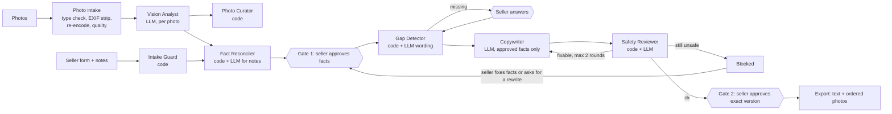

# AI Marketplace Listing Assistant

A local AI application that helps sellers create second-hand car listings from verified facts.

The workflow combines image analysis, structured fact extraction, human review, controlled
LLM generation, and a second safety pass before export.

The key design rule is simple:

**No evidence, no claim.**

Every claim in the final listing must reference an approved fact. Python controls the workflow,
while LLMs are isolated to specific tasks such as vision analysis and copy generation.

## Engineering highlights

- Deterministic workflow orchestration
- Multi-agent architecture with strict Pydantic contracts
- Least-privilege tool permissions
- Evidence-linked claims
- Two human approval gates
- Prompt injection and PII safeguards
- Code-derived safety decisions
- Versioned prompts and append-only audit records
- Red-team tests and a synthetic golden set

All data in the repository is synthetic, and market figures are not real prices. The app does
not publish listings. It only exports the final text and ordered photos.

## How it works



The orchestrator is plain Python (`workflow.py`). Listing status moves through an explicit
state machine that the database also enforces with triggers. A blocked draft can be recovered
by changing the facts or requesting another draft. The listing text is written in the owner's
first person; the spec and equipment lists are rendered by code from approved facts. The UI
is in Turkish.

| Agent | Kind | Sees | Cannot |
| --- | --- | --- | --- |
| Intake Guard | code | seller text | call a model |
| Vision Analyst | LLM | one photo, observable fields | report unobservable fields, write text |
| Photo Curator | code | vision views, quality metrics | call a model |
| Fact Reconciler | code + LLM | seller facts, photo proposals, notes | approve anything |
| Gap Detector | code + LLM | schema, approved facts | see seller text |
| Market Analyst | code | approved make/model/year | call a model, write text |
| Copywriter | LLM | approved facts only | see photos or notes, cite unapproved facts |
| Safety Reviewer | code + LLM | draft, approved facts | clear an issue found by code |

## Security

- Seller notes, text in photos and change requests go into escaped tags and are treated as
  data. Injection-like wording is flagged and logged.
- Model output must fit a strict Pydantic model; output with extra fields is discarded.
- A permission matrix decides which agent may call which tool. Tools are bound to one listing.
- National IDs and IBANs are refused; phone numbers need confirmation. GPS metadata is removed
  on upload.
- Database triggers block export unless the latest draft has a final approval. Audit records
  cannot be changed.

Details are in [docs/architecture.md](docs/architecture.md).

## Evaluation

Results from the test suite, run with a deterministic fake model and no network:

| Check | Result |
| --- | --- |
| Tests | 465 collected: 464 passed, 1 live API test skipped |
| Golden set | 20 synthetic cases in 5 groups |
| Generated listings with a claim citing a non-approved fact | 0 of 12 |
| Generated listings with a number not found in the cited facts | 0 of 12 |
| Planted national IDs and IBANs refused at intake | 8 of 8 |
| Injection notes flagged | 4 of 4 |
| Red-team tests (8 scenarios + 2 variants) | 10 of 10 pass |

These tests check the pipeline's guarantees, not model quality. Measuring vision accuracy
needs real, licensed photos and live runs.

```powershell
pytest                    # full suite, no API key needed
ruff check .
$env:RUN_LIVE_TESTS = "1"; pytest tests/test_live_api.py   # optional, calls the real API
```

## Quick start (Windows PowerShell)

Requirements: Python 3.12+ and Git.

```powershell
git clone https://github.com/ozcivitcagkan/AI-Marketplace-Listing-Assistant.git
cd AI-Marketplace-Listing-Assistant
py -3 -m venv .venv
.venv\Scripts\Activate.ps1
python -m pip install -e ".[ui,dev]"
$env:ANTHROPIC_API_KEY = "<your key>"   # needed for analysis and writing
streamlit run app/streamlit_app.py
```

The app listens on `http://localhost:8501` only, because it has no user accounts. Data is
stored in `data/` (git-ignored).

| Variable | Default | Meaning |
| --- | --- | --- |
| `ANTHROPIC_API_KEY` | | Read by the Anthropic SDK; never stored by the app |
| `LA_MODEL` | `claude-opus-5` | Model ID |
| `LA_DATA_DIR` | `data` | SQLite database and photo folder |
| `LA_MAX_PHOTOS_PER_LISTING` | `20` | Upload count limit |
| `LA_MAX_PHOTO_BYTES` | `10485760` | Per-file size limit |
| `LA_MAX_LLM_CALLS_PER_LISTING` | `40` | Model call budget per listing |

## Project layout

```
src/listing_assistant/
  workflow.py          orchestrator and service layer
  state_machine.py     the only code that changes a listing's status
  tools.py, toolset.py permission matrix and listing-bound tools
  agents/              one module per agent
  llm.py, agent_io.py  model boundary and model output shapes
  db/                  SQLite migrations and repositories
  prompts/, schemas/   versioned prompts and the car field definitions
app/streamlit_app.py   UI
tests/                 unit, workflow, UI, red-team and golden-set tests
```

## Limitations

- Car category only; a house category needs a new schema file.
- Single local user without authentication, and no moderator panel.
- PII detection is pattern-based. The seller's review is the final check, and there is no
  automatic blurring.

## License

MIT, see [LICENSE](LICENSE).
